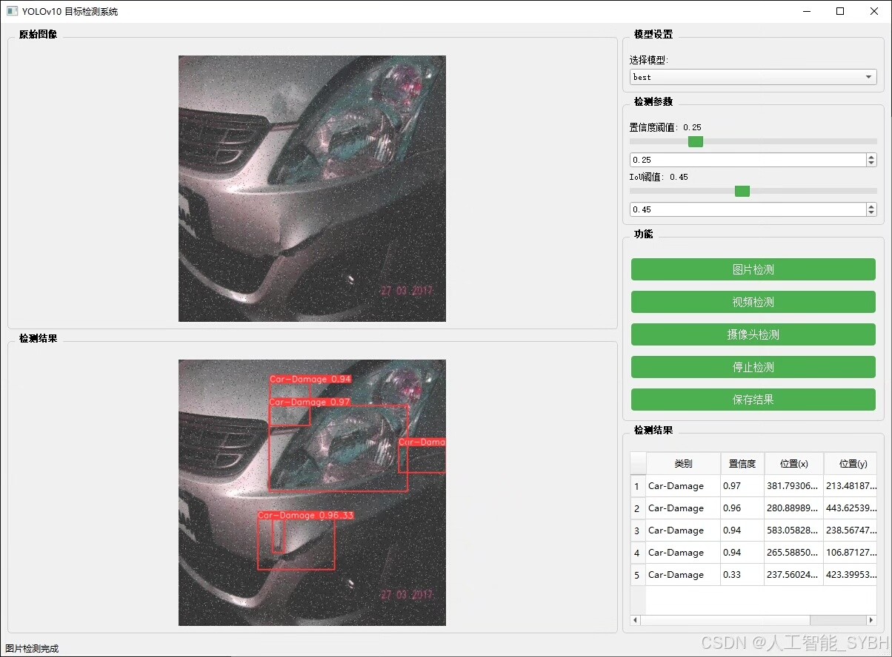
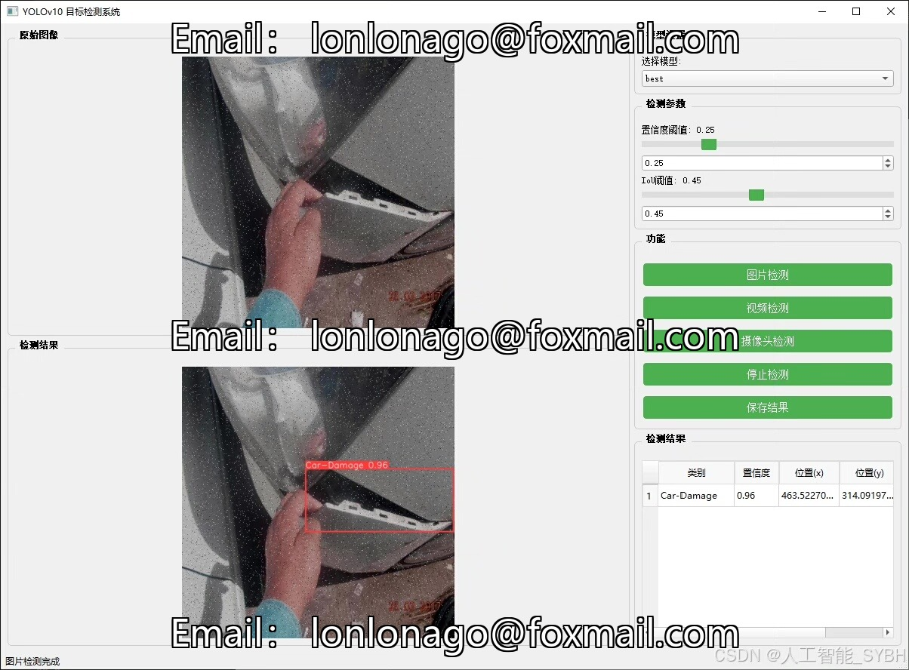
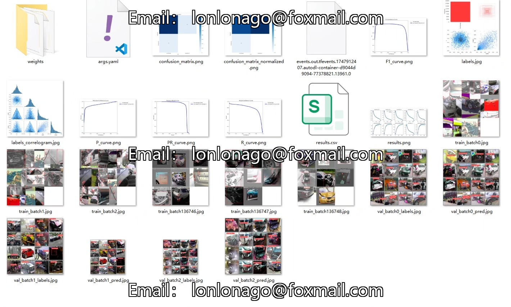
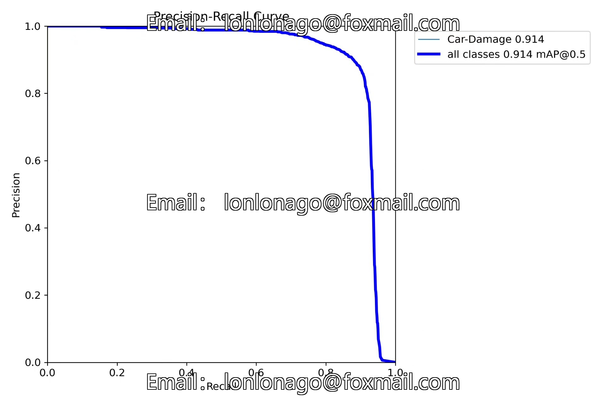
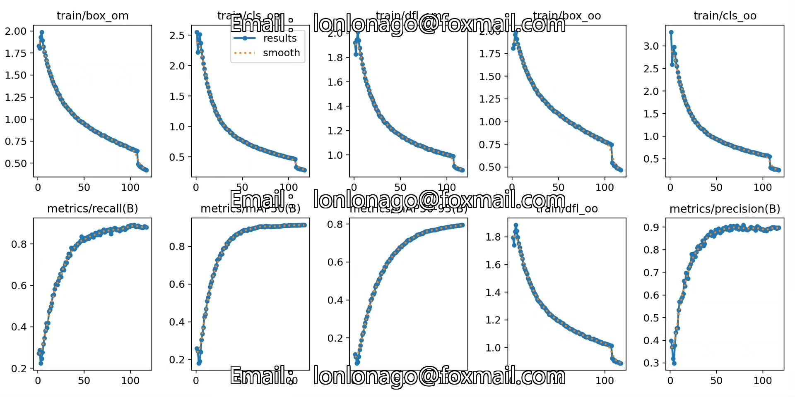
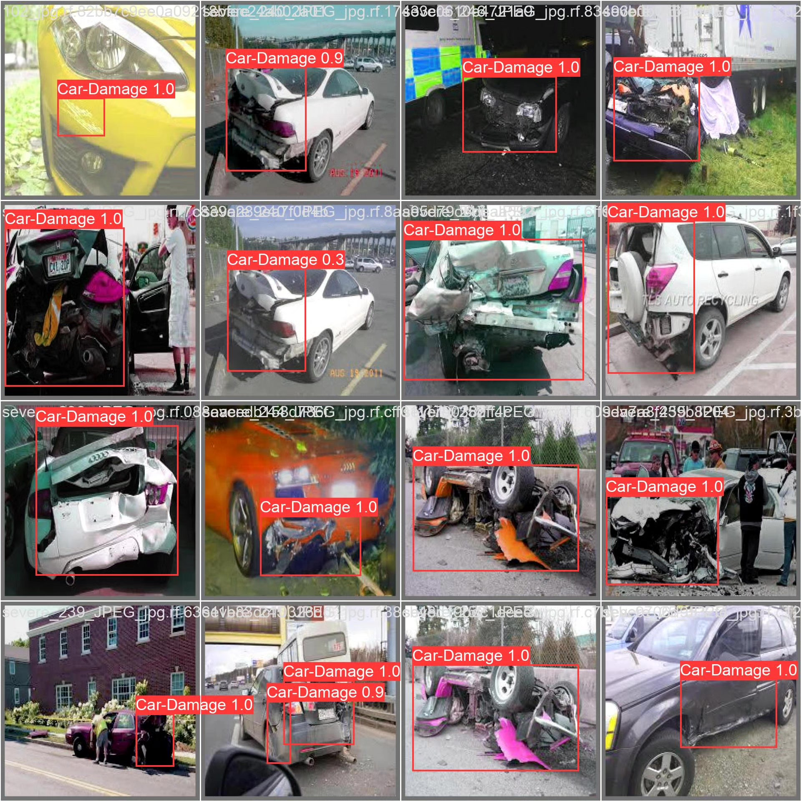
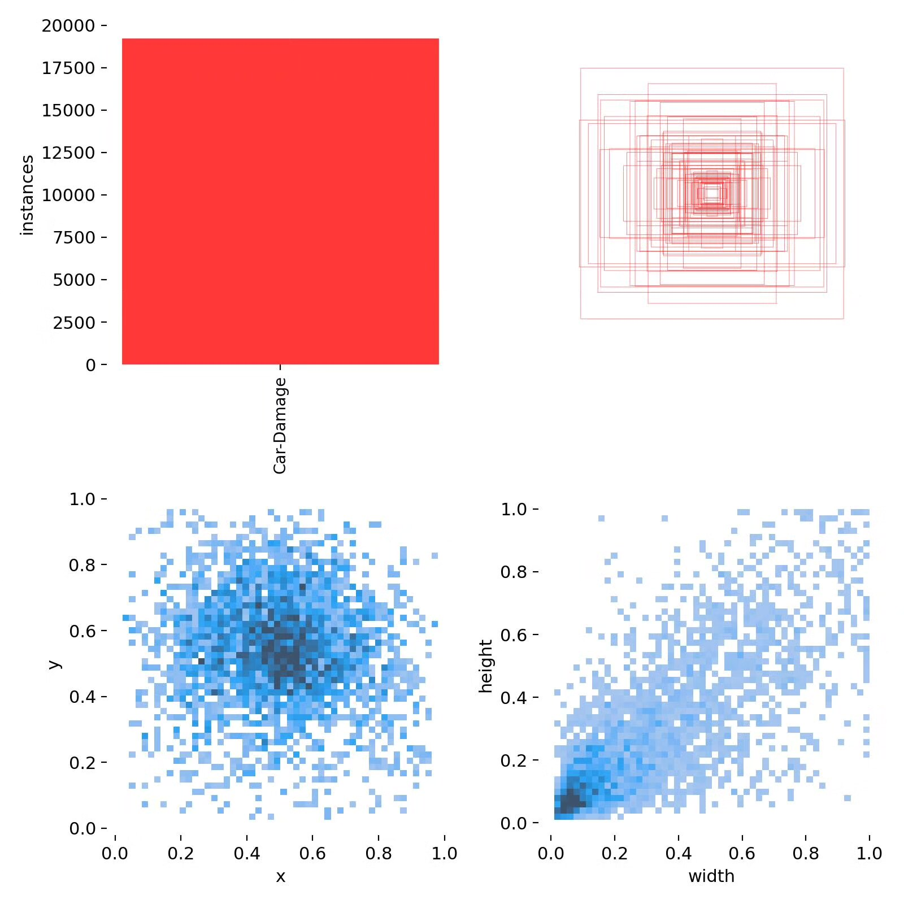
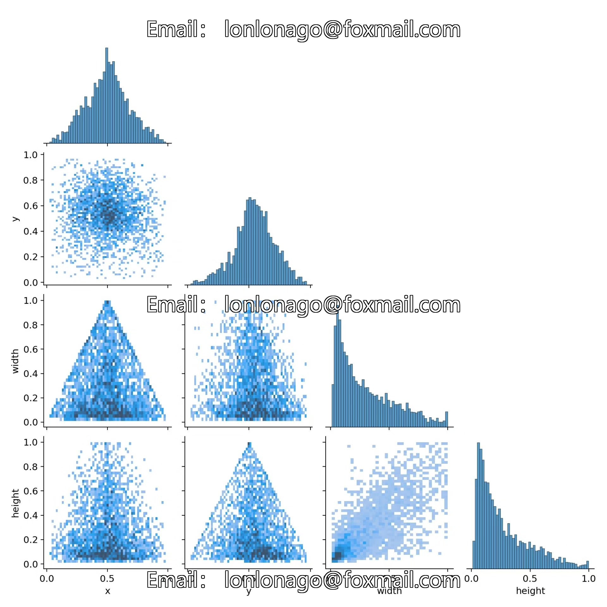

# Based on deep learning YOLOv10 for automotive damage detection system

## Body

Based on the cutting-edge YOLOv10 object detection algorithm, this project has developed a high-precision car damage recognition detection system. It is specifically designed for quickly and accurately identifying various types of vehicle damage. The system uses a professional dataset containing 11,675 high-quality images of car damage for training and evaluation, with 10,218 training images, 971 validation images, and 486 test images. This detection system achieves precise recognition of car scratches, dents, cracks, and broken parts, which can be widely applied in areas such as insurance claims, used car valuation, auto repair shop quality inspection, shared car operation management, and safety monitoring for autonomous driving. It provides an intelligent technical solution for the aftermarket services of cars.

The company's products have obtained YOLO official commercial license certification.

We provide after-sales service.

After payment, we will provide WeChat ID to answer questions anytime.

Environmental configuration: We will provide a tutorial on environmental configuration, and WeChat will provide答疑.

Remote installation service: If you need remote configuration, an additional fee of 69 is required.
If the configuration fails, all fees will be refunded (specially for old computers only refund installation fees).

Retraining dataset: After setting up the environment, you can train on your own computer.
If you need us to retrain, just pay 69 + computing power fees (2.5 yuan/hour)

## Images

## Payment

Here is a pay link on Stripe ( https://buy.stripe.com/3cs8yP7sY87d0vu9AB ). Please contact me lonlonago@foxmail.com after funding $89, and I will send you a complete data files , thank you!

